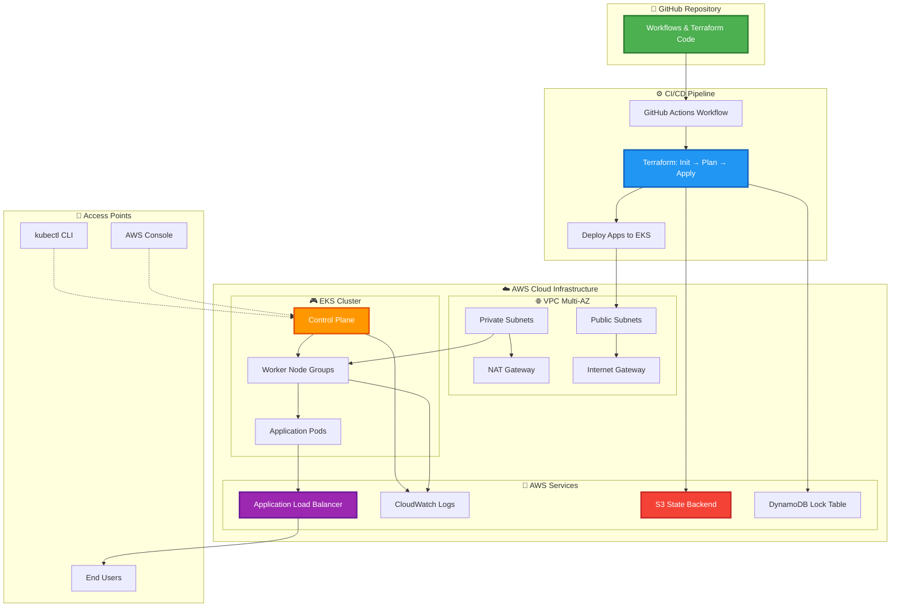

# 🚀 Terraform-AWS-EKS-Pipeline

> **Enterprise-Grade Kubernetes Infrastructure Automation on AWS**

A production-ready Infrastructure as Code (IaC) solution for provisioning and managing Amazon Elastic Kubernetes Service (EKS) clusters using Terraform and automated CI/CD pipelines with GitHub Actions.

---

## 📋 Table of Contents

- [Overview](#-overview)
- [Architecture](#-architecture)
- [Key Features](#-key-features)
- [Technology Stack](#-technology-stack)
- [Prerequisites](#-prerequisites)
- [Project Structure](#-project-structure)
- [Getting Started](#-getting-started)
- [CI/CD Pipeline](#-cicd-pipeline)
- [Infrastructure Components](#-infrastructure-components)
- [Security Features](#-security-features)
- [Monitoring & Observability](#-monitoring--observability)
- [Cost Optimization](#-cost-optimization)
- [Troubleshooting](#-troubleshooting)

---

## 🎯 Overview

CloudOps-EKS-Pipeline is a comprehensive DevOps solution that automates the entire lifecycle of AWS EKS cluster deployment. This project demonstrates industry best practices for:

- **Infrastructure as Code (IaC)** using Terraform for reproducible infrastructure
- **GitOps Methodology** with GitHub Actions for automated deployments
- **Multi-Environment Management** supporting dev, staging, and production environments
- **Security Hardening** with IAM roles, security groups, and network policies
- **High Availability** with multi-AZ deployments and auto-scaling capabilities

This project is ideal for DevOps Engineers, Cloud Architects, and SREs looking to implement enterprise-grade Kubernetes infrastructure on AWS.

---

## 🏗️ Architecture



### 🔍 Architecture Components

| Layer | Component | Description |
|-------|-----------|-------------|
| **GitHub Layer** | Version Control | Infrastructure code, workflows, and PR validations |
| **Network Layer** | VPC Infrastructure | Custom VPC with multi-AZ public/private subnets, NAT Gateways, IGW |
| **Compute Layer** | EKS Cluster | Managed control plane, auto-scaling worker nodes, mixed instance types |
| **Security Layer** | IAM & Network Security | RBAC, security groups, OIDC authentication, encrypted communications |
| **Operations Layer** | Monitoring & State | CloudWatch logs/metrics, S3 state backend, DynamoDB locking |

---

## ✨ Key Features

### 🤖 Infrastructure Automation
- ✅ **Fully Automated EKS Provisioning** - Zero manual intervention required
- ✅ **Multi-Environment Support** - Separate configurations for dev, staging, and production
- ✅ **Remote State Management** - S3 backend with DynamoDB locking for team collaboration
- ✅ **Modular Terraform Design** - Reusable modules for VPC, EKS, IAM, and networking

### 🚀 High Availability & Scalability
- ✅ **Multi-AZ Deployment** - Cluster spans multiple availability zones for resilience
- ✅ **Auto-Scaling Node Groups** - Dynamic scaling based on workload demands
- ✅ **Cluster Autoscaler** - Kubernetes-native pod and node autoscaling
- ✅ **Load Balancer Integration** - AWS ALB for intelligent traffic distribution

### 🔒 Security & Compliance
- ✅ **IAM Role-Based Access** - Granular permissions with least privilege principle
- ✅ **Private Subnet Deployment** - Worker nodes isolated from direct internet access
- ✅ **Security Group Controls** - Network-level firewall rules
- ✅ **OIDC Integration** - Secure authentication for Kubernetes service accounts
- ✅ **Secrets Management** - AWS Secrets Manager and Parameter Store integration

### 🔄 CI/CD & GitOps
- ✅ **GitHub Actions Workflows** - Automated testing, planning, and deployment
- ✅ **Pull Request Validation** - Automatic Terraform plan on every PR
- ✅ **Environment Promotion** - Safe progression from dev to production
- ✅ **Rollback Capabilities** - Quick infrastructure rollback on failures

### 💰 Cost Optimization
- ✅ **Spot Instance Support** - Up to 90% cost savings for non-critical workloads
- ✅ **Right-Sized Instances** - Optimized instance types and configurations
- ✅ **Resource Tagging** - Comprehensive cost allocation and tracking
- ✅ **Automated Cleanup** - Scheduled destroy workflows for dev environments

---

## 🛠️ Technology Stack

| Category | Technology | Purpose |
|----------|-----------|---------|
| **☁️ Cloud Provider** | AWS | Infrastructure hosting and managed services |
| **⎈ Container Orchestration** | Amazon EKS (Kubernetes 1.28) | Containerized application management |
| **🏗️ Infrastructure as Code** | Terraform 1.5+ | Infrastructure provisioning and management |
| **🔄 CI/CD** | GitHub Actions | Automated deployment pipelines |
| **💾 State Management** | S3 + DynamoDB | Terraform state storage and locking |
| **🌐 Networking** | AWS VPC, NAT Gateway, IGW | Network infrastructure and connectivity |
| **🔐 Security** | IAM, Security Groups, OIDC | Access control and authentication |
| **📊 Monitoring** | CloudWatch, Prometheus | Logging, metrics, and observability |
| **⚖️ Load Balancing** | AWS Application Load Balancer | Traffic distribution and routing |

---

## 📦 Prerequisites

### Required Tools

Ensure you have the following tools installed:

```bash
# AWS CLI (v2.x or later)
aws --version
# Expected: aws-cli/2.x.x

# Terraform (v1.5.x or later)
terraform version
# Expected: Terraform v1.5.x or higher

# kubectl (compatible with EKS 1.28)
kubectl version --client
# Expected: Client Version: v1.28.x

# Git
git --version
# Expected: git version 2.x.x
```

### ☁️ AWS Account Setup

- AWS Account with administrative access
- AWS CLI configured with appropriate credentials
- S3 bucket for Terraform state (created via bootstrap script)
- DynamoDB table for state locking (created via bootstrap script)

### 🔧 GitHub Setup

- GitHub account with repository access
- GitHub Actions enabled on repository
- Required GitHub Secrets configured:
  - `AWS_REGION` - Your target AWS region
  - `AWS_ACCOUNT_ID` - Your AWS account ID
  - `AWS_ROLE_ARN` - IAM role for GitHub Actions OIDC

### 📚 Knowledge Requirements

- Basic understanding of Kubernetes concepts (pods, deployments, services)
- Familiarity with Terraform and Infrastructure as Code principles
- Experience with AWS services (VPC, EC2, IAM, EKS)
- Understanding of CI/CD pipelines and GitOps workflows

---

## 📁 Project Structure

```
CloudOps-EKS-Pipeline/
│
├── 📂 .github/
│   └── workflows/
│       ├── terraform-plan.yml          # PR validation workflow
│       ├── terraform-apply.yml         # Deployment workflow
│       └── terraform-destroy.yml       # Cleanup workflow
│
├── 📂 terraform/
│   ├── modules/
│   │   ├── vpc/                        # VPC and networking module
│   │   │   ├── main.tf
│   │   │   ├── variables.tf
│   │   │   └── outputs.tf
│   │   ├── eks/                        # EKS cluster module
│   │   │   ├── main.tf
│   │   │   ├── variables.tf
│   │   │   └── outputs.tf
│   │   ├── iam/                        # IAM roles and policies
│   │   │   ├── main.tf
│   │   │   ├── variables.tf
│   │   │   └── outputs.tf
│   │   └── security-groups/            # Security group configurations
│   │       ├── main.tf
│   │       ├── variables.tf
│   │       └── outputs.tf
│   │
│   ├── environments/
│   │   ├── dev/                        # Development environment
│   │   │   ├── main.tf
│   │   │   ├── backend.tf
│   │   │   ├── variables.tf
│   │   │   └── terraform.tfvars
│   │   ├── staging/                    # Staging environment
│   │   │   └── ...
│   │   └── production/                 # Production environment
│   │       └── ...
│   │
│   └── scripts/
│       ├── bootstrap.sh                # Initial AWS setup script
│       └── configure-kubectl.sh        # kubectl configuration helper
│
├── 📂 k8s/
│   ├── deployments/
│   │   └── sample-app.yaml
│   ├── services/
│   │   └── sample-service.yaml
│   └── ingress/
│       └── alb-ingress.yaml
│
├── 📂 docs/
│   ├── ARCHITECTURE.md                 # Detailed architecture documentation
│   ├── DEPLOYMENT.md                   # Deployment guide
│   └── TROUBLESHOOTING.md              # Common issues and solutions
│
├── .gitignore
├── README.md                           # This file
└── LICENSE
```

---

## 🚀 Getting Started

### Step 1: Clone the Repository

```bash
git clone https://github.com/yourusername/CloudOps-EKS-Pipeline.git
cd CloudOps-EKS-Pipeline
```

### Step 2: Configure AWS Credentials

Choose one of the following authentication methods:

```bash
# Option 1: Using AWS CLI profile (Recommended)
export AWS_PROFILE=your-profile-name

# Option 2: Using environment variables
export AWS_ACCESS_KEY_ID=your-access-key
export AWS_SECRET_ACCESS_KEY=your-secret-key
export AWS_DEFAULT_REGION=us-east-1

# Verify credentials
aws sts get-caller-identity
```

### Step 3: Initialize Terraform Backend

```bash
# Run bootstrap script to create S3 bucket and DynamoDB table
cd terraform/scripts
chmod +x bootstrap.sh
./bootstrap.sh

# Navigate to your target environment
cd ../environments/dev
```

### Step 4: Update Configuration

Edit `terraform.tfvars` with your specific values:

```hcl
# Project Configuration
project_name     = "cloudops-eks"
environment      = "dev"
aws_region       = "us-east-1"

# Network Configuration
vpc_cidr         = "10.0.0.0/16"
availability_zones = ["us-east-1a", "us-east-1b"]

# EKS Configuration
cluster_version  = "1.28"

# Node Group Configuration
node_group_config = {
  desired_size   = 2
  min_size       = 1
  max_size       = 5
  instance_types = ["t3.medium"]
  disk_size      = 30
}

# Spot Instance Configuration (Optional)
spot_node_group_config = {
  desired_size   = 2
  min_size       = 0
  max_size       = 10
  instance_types = ["t3.medium", "t3a.medium"]
}

# Resource Tags
tags = {
  Environment = "dev"
  Project     = "CloudOps-EKS"
  ManagedBy   = "Terraform"
  Owner       = "DevOps Team"
}
```

### Step 5: Deploy Infrastructure

```bash
# Initialize Terraform (download providers and modules)
terraform init

# Validate configuration syntax
terraform validate

# Review the execution plan
terraform plan -out=tfplan

# Apply the configuration
terraform apply tfplan
```

**Expected Output:**
```
Apply complete! Resources: 45 added, 0 changed, 0 destroyed.

Outputs:
cluster_endpoint = "https://XXXXX.eks.us-east-1.amazonaws.com"
cluster_name = "cloudops-eks-dev"
cluster_security_group_id = "sg-XXXXX"
```

### Step 6: Configure kubectl

```bash
# Update kubeconfig to access your cluster
aws eks update-kubeconfig \
  --region us-east-1 \
  --name cloudops-eks-dev \
  --alias cloudops-eks-dev

# Verify connection
kubectl cluster-info
kubectl get nodes
kubectl get pods --all-namespaces
```

**Expected Output:**
```
NAME                         STATUS   ROLES    AGE   VERSION
ip-10-0-1-123.ec2.internal   Ready    <none>   5m    v1.28.x
ip-10-0-2-234.ec2.internal   Ready    <none>   5m    v1.28.x
```

### Step 7: Deploy Sample Application

```bash
# Deploy sample application
kubectl apply -f ../../k8s/deployments/sample-app.yaml
kubectl apply -f ../../k8s/services/sample-service.yaml

# Check deployment status
kubectl get deployments
kubectl get services
kubectl get pods

# Get application URL (if using LoadBalancer)
kubectl get svc sample-service -o jsonpath='{.status.loadBalancer.ingress[0].hostname}'
```

---

## ⚙️ CI/CD Pipeline

### Workflow Overview

The project includes three main GitHub Actions workflows for complete automation:

#### 1. 🔍 **Terraform Plan** (Pull Request Validation)

**Triggers:** Pull requests to `main` branch

**Actions:**
- Runs `terraform fmt` to check code formatting
- Executes `terraform validate` for syntax validation
- Generates `terraform plan` to preview changes
- Posts plan output as PR comment for review
- Ensures code quality before merging

**Example PR Comment:**
```
📋 Terraform Plan Summary
Resources: 5 to add, 2 to change, 0 to destroy

View detailed plan in Actions logs
```

#### 2. 🚀 **Terraform Apply** (Deployment)

**Triggers:** 
- Push to `main` branch
- Manual workflow dispatch

**Actions:**
- Authenticates using OIDC (no static credentials stored)
- Executes `terraform apply` to deploy changes
- Updates EKS cluster configuration
- Deploys Kubernetes manifests
- Sends deployment notifications

**Security Features:**
- Uses temporary AWS credentials via OIDC
- No long-lived access keys
- Audit trail via CloudTrail

#### 3. 🗑️ **Terraform Destroy** (Cleanup)

**Triggers:** Manual workflow dispatch only

**Actions:**
- Requires explicit approval for production
- Gracefully drains workloads
- Destroys infrastructure in correct order
- Cleans up AWS resources
- Useful for cost management in dev/test environments

**Safety Features:**
- Environment-specific approval requirements
- Confirmation prompts
- Resource deletion order management

### Setting Up GitHub Actions

#### Step 1: Configure OIDC Provider in AWS

```bash
# Create OIDC provider
aws iam create-open-id-connect-provider \
  --url https://token.actions.githubusercontent.com \
  --client-id-list sts.amazonaws.com \
  --thumbprint-list 6938fd4d98bab03faadb97b34396831e3780aea1
```

#### Step 2: Create IAM Role for GitHub Actions

Create `github-actions-role.json`:

```json
{
  "Version": "2012-10-17",
  "Statement": [
    {
      "Effect": "Allow",
      "Principal": {
        "Federated": "arn:aws:iam::YOUR_ACCOUNT_ID:oidc-provider/token.actions.githubusercontent.com"
      },
      "Action": "sts:AssumeRoleWithWebIdentity",
      "Condition": {
        "StringEquals": {
          "token.actions.githubusercontent.com:aud": "sts.amazonaws.com"
        },
        "StringLike": {
          "token.actions.githubusercontent.com:sub": "repo:YOUR_ORG/YOUR_REPO:*"
        }
      }
    }
  ]
}
```

Apply the role:

```bash
aws iam create-role \
  --role-name github-actions-eks-role \
  --assume-role-policy-document file://github-actions-role.json

# Attach necessary policies
aws iam attach-role-policy \
  --role-name github-actions-eks-role \
  --policy-arn arn:aws:iam::aws:policy/AdministratorAccess
```

#### Step 3: Configure GitHub Secrets

Navigate to: **Settings → Secrets and variables → Actions**

Add these secrets:

| Secret Name | Value | Description |
|-------------|-------|-------------|
| `AWS_REGION` | `us-east-1` | Target AWS region |
| `AWS_ACCOUNT_ID` | `123456789012` | Your AWS account ID |
| `AWS_ROLE_ARN` | `arn:aws:iam::...` | IAM role ARN for OIDC |
| `TF_STATE_BUCKET` | `terraform-state-bucket` | S3 bucket for state |
| `TF_LOCK_TABLE` | `terraform-state-lock` | DynamoDB lock table |

---

## 🏗️ Infrastructure Components

### 🌐 VPC & Networking

**Configuration:**
- **CIDR Block:** Configurable (default: `10.0.0.0/16`)
- **Availability Zones:** 2 or more for high availability
- **Public Subnets:** 
  - CIDR: `10.0.1.0/24`, `10.0.2.0/24`
  - Used for: NAT Gateways, Bastion hosts, Load Balancers
  - Internet access via Internet Gateway
- **Private Subnets:** 
  - CIDR: `10.0.11.0/24`, `10.0.12.0/24`
  - Used for: EKS worker nodes, RDS databases
  - Internet access via NAT Gateway
- **NAT Gateways:** One per AZ for high availability
- **Route Tables:** Separate tables for public and private traffic
- **VPC Endpoints:** S3, ECR, CloudWatch for private AWS service access

### ⎈ EKS Cluster

**Control Plane:**
- Fully managed by AWS across multiple AZs
- Automatic version updates and security patches
- Integrated with AWS IAM for authentication
- API server endpoint: Public or private configurable

**Configuration:**
- **Kubernetes Version:** 1.28 (configurable)
- **Cluster Endpoint:** Public access with optional IP whitelisting
- **Logging:** API server, audit, authenticator, controller manager, scheduler

**Add-ons:**
- **VPC CNI:** Pod networking within VPC
- **CoreDNS:** Cluster DNS resolution
- **kube-proxy:** Network proxying and load balancing
- **EBS CSI Driver:** Persistent volume support
- **AWS Load Balancer Controller:** ALB/NLB integration

### 🖥️ Node Groups

**On-Demand Node Group:**
```hcl
node_group_config = {
  desired_size   = 2
  min_size       = 1
  max_size       = 5
  instance_types = ["t3.medium"]
  capacity_type  = "ON_DEMAND"
  disk_size      = 30
}
```

**Spot Instance Node Group:**
```hcl
spot_node_group_config = {
  desired_size   = 2
  min_size       = 0
  max_size       = 10
  instance_types = ["t3.medium", "t3a.medium", "t3.large"]
  capacity_type  = "SPOT"
  disk_size      = 30
}
```

**Features:**
- AMI: AWS EKS-optimized Amazon Linux 2
- Auto-scaling based on CPU/Memory metrics
- User data scripts for node bootstrapping
- Instance metadata service v2 (IMDSv2) required
- EBS optimization enabled

### 🔐 IAM Roles

**Cluster Service Role:**
- Permissions for EKS control plane operations
- CloudWatch Logs access
- EC2 and ELB management

**Node Instance Role:**
- EC2 Container Registry (ECR) pull permissions
- CloudWatch Logs and metrics publishing
- EC2 describe permissions for auto-scaling

**Service Account Roles (IRSA):**
- AWS Load Balancer Controller
- EBS CSI Driver
- Cluster Autoscaler
- External DNS
- Custom application roles

---

## 🔒 Security Features

### 🛡️ Network Security

**Defense in Depth:**
- ✅ Worker nodes deployed in private subnets (no direct internet exposure)
- ✅ Security groups with least privilege ingress/egress rules
- ✅ Network ACLs for additional subnet-level protection
- ✅ VPC Flow Logs enabled for network traffic analysis
- ✅ AWS WAF integration for application-layer protection

**Security Groups:**

| Group | Purpose | Inbound Rules | Outbound Rules |
|-------|---------|---------------|----------------|
| `cluster-sg` | EKS Control Plane | Nodes on 443, 10250 | All to nodes |
| `node-sg` | Worker Nodes | Cluster + inter-node | All outbound |
| `bastion-sg` | Bastion Host | SSH from corp IPs | All outbound |
| `alb-sg` | Load Balancer | HTTP/HTTPS from 0.0.0.0/0 | To node-sg |

### 🔑 Access Control

**IAM Integration:**
- IAM roles mapped to Kubernetes RBAC groups
- OIDC provider for service account authentication (IRSA)
- No long-lived credentials for workloads
- Temporary credentials via AWS STS

**Kubernetes RBAC:**
```yaml
# Example: Developer role with limited permissions
apiVersion: rbac.authorization.k8s.io/v1
kind: Role
metadata:
  name: developer
  namespace: default
rules:
- apiGroups: ["", "apps"]
  resources: ["pods", "deployments", "services"]
  verbs: ["get", "list", "watch", "create", "update", "patch"]
```

**Access Methods:**
- `kubectl` via IAM authentication
- AWS Console (EKS workloads view)
- AWS Systems Manager Session Manager (no SSH keys)
- Bastion host for emergency access

### 🔐 Data Protection

**Encryption:**
- ✅ **At Rest:** EBS volumes encrypted with KMS
- ✅ **In Transit:** TLS 1.2+ for all communications
- ✅ **Secrets:** Kubernetes secrets encrypted with KMS
- ✅ **Logs:** CloudWatch Logs encrypted

**Secrets Management:**
```bash
# Store secrets in AWS Secrets Manager
aws secretsmanager create-secret \
  --name dev/database/password \
  --secret-string '{"password":"SecureP@ssw0rd"}'

# Reference in Kubernetes via External Secrets Operator
```

### ✅ Compliance & Audit

**Logging & Monitoring:**
- CloudTrail: All API calls logged and retained
- VPC Flow Logs: Network traffic patterns and anomalies
- EKS Audit Logs: Kubernetes API server access
- CloudWatch Logs: Application and system logs

**Resource Tagging Strategy:**
```hcl
tags = {
  Environment    = "production"
  Project        = "CloudOps-EKS"
  ManagedBy      = "Terraform"
  Owner          = "DevOps Team"
  CostCenter     = "Engineering"
  Compliance     = "PCI-DSS"
  DataClass      = "Confidential"
}
```

---

## 📊 Monitoring & Observability

### CloudWatch Integration

**Cluster Logging:**
```bash
# View EKS control plane logs
aws logs tail /aws/eks/cloudops-eks-dev/cluster --follow

# Filter for authentication failures
aws logs filter-pattern /aws/eks/cloudops-eks-dev/cluster \
  --filter-pattern "Forbidden"
```

**Container Insights:**
- Cluster-level CPU, memory, network, and disk metrics
- Pod and node performance metrics
- Application log aggregation
- Custom CloudWatch dashboards

**Metrics Collection:**
```bash
# Install CloudWatch Container Insights
kubectl apply -f https://raw.githubusercontent.com/aws-samples/amazon-cloudwatch-container-insights/latest/k8s-deployment-manifest-templates/deployment-mode/daemonset/container-insights-monitoring/quickstart/cwagent-fluentd-quickstart.yaml
```

### Kubernetes Metrics Server

**Installation:**
```bash
# Deploy metrics server
kubectl apply -f https://github.com/kubernetes-sigs/metrics-server/releases/latest/download/components.yaml

# Verify installation
kubectl get deployment metrics-server -n kube-system
```

**Usage:**
```bash
# View node resource usage
kubectl top nodes

# View pod resource usage
kubectl top pods -A

# View pod resource usage sorted by CPU
kubectl top pods -A --sort-by=cpu
```

### Prometheus & Grafana (Optional)

**Deploy Prometheus Stack:**
```bash
# Add Helm repository
helm repo add prometheus-community https://prometheus-community.github.io/helm-charts
helm repo update

# Install kube-prometheus-stack
helm install prometheus prometheus-community/kube-prometheus-stack \
  --namespace monitoring \
  --create-namespace \
  --set prometheus.prometheusSpec.retention=30d \
  --set grafana.enabled=true
```

**Access Grafana:**
```bash
# Port forward to access Grafana UI
kubectl port-forward -n monitoring svc/prometheus-grafana 3000:80

# Default credentials: admin / prom-operator
```

### Alerting

**CloudWatch Alarms:**
```hcl
# Example: High CPU usage alarm
resource "aws_cloudwatch_metric_alarm" "high_cpu" {
  alarm_name          = "eks-high-cpu-${var.environment}"
  comparison_operator = "GreaterThanThreshold"
  evaluation_periods  = "2"
  metric_name         = "CPUUtilization"
  namespace           = "AWS/EKS"
  period              = "300"
  statistic           = "Average"
  threshold           = "80"
  alarm_description   = "This metric monitors EKS cluster CPU utilization"
  alarm_actions       = [aws_sns_topic.alerts.arn]
}
```

---

## 💰 Cost Optimization

### Implemented Strategies

#### 1. **Spot Instances** (Up to 90% savings)
```hcl
# Configure spot node group for non-critical workloads
spot_node_group_config = {
  capacity_type  = "SPOT"
  instance_types = ["t3.medium", "t3a.medium", "t3.large"]  # Diversify for availability
  desired_size   = 3
  min_size       = 0
  max_size       = 10
}
```

**Best Practices:**
- Use multiple instance types for better availability
- Deploy stateless applications on spot instances
- Implement graceful shutdown handlers
- Use pod disruption budgets

#### 2. **Right-Sizing**
```bash
# Analyze resource usage
kubectl top nodes
kubectl top pods -A

# Identify over-provisioned pods
kubectl describe pod <pod-name> | grep -A 5 "Requests"
```

**Recommendations:**
- Start with t3.medium for general workloads
- Use t3.small for lightweight services
- Scale to t3.large/xlarge for compute-intensive tasks
- Enable burstable performance with T-series instances

#### 3. **Auto-Scaling**
```yaml
# Horizontal Pod Autoscaler
apiVersion: autoscaling/v2
kind: HorizontalPodAutoscaler
metadata:
  name: app-hpa
spec:
  scaleTargetRef:
    apiVersion: apps/v1
    kind: Deployment
    name: sample-app
  minReplicas: 2
  maxReplicas: 10
  metrics:
  - type: Resource
    resource:
      name: cpu
      target:
        type: Utilization
        averageUtilization: 70
```

#### 4. **Reserved Instances & Savings Plans**
```bash
# For predictable production workloads
# Purchase 1-year or 3-year reservations for:
# - Baseline EKS node capacity
# - RDS databases
# - ElastiCache instances

# Estimated savings: 30-60% vs on-demand
```

#### 5. **Resource Tagging**
```hcl
# Track costs by environment and project
tags = {
  Environment = "production"
  Project     = "CloudOps-EKS"
  CostCenter  = "Engineering"
  Owner       = "DevOps Team"
}
```

### Cost Monitoring

**AWS Cost Explorer:**
```bash
# Get cost breakdown by environment tag
aws ce get-cost-and-usage \
  --time-period Start=2024-10-01,End=2024-10-31 \
  --granularity MONTHLY \
  --metrics BlendedCost UnblendedCost \
  --group-by Type=TAG,Key=Environment

# Get EKS-specific costs
aws ce get-cost-and-usage \
  --time-period Start=2024-10-01,End=2024-10-31 \
  --granularity DAILY \
  --filter file://filter.json \
  --metrics BlendedCost
```

**filter.json:**
```json
{
  "Dimensions": {
    "Key": "SERVICE",
    "Values": ["Amazon Elastic Kubernetes Service", "Amazon EC2 Container Service"]
  }
}
```

**Cost Optimization Checklist:**
- [ ] Enable cluster autoscaler to scale down during low traffic
- [ ] Use spot instances for 30-50% of capacity
- [ ] Right-size node instance types based on actual usage
- [ ] Delete unused EBS volumes and snapshots
- [ ] Use VPC endpoints to avoid NAT Gateway charges
- [ ] Implement pod resource requests and limits
- [ ] Schedule non-critical workloads during off-peak hours
- [ ] Archive old CloudWatch logs to S3 Glacier

---

## 🔧 Troubleshooting

### Common Issues & Solutions

#### Issue 1: Cluster Creation Timeout

**Symptoms:**
- Terraform hangs during EKS cluster creation
- Cluster stuck in "CREATING" state

**Diagnosis:**
```bash
# Check CloudFormation stack status
aws cloudformation describe-stacks \
  --stack-name eksctl-cloudops-eks-dev-cluster \
  --query 'Stacks[0].StackStatus'

# Check CloudFormation events for errors
aws cloudformation describe-stack-events \
  --stack-name eksctl-cloudops-eks-dev-cluster \
  --max-items 20

# Check EKS cluster status
aws eks describe-cluster \
  --name cloudops-eks-dev \
  --query 'cluster.status'
```

**Common Causes & Solutions:**
1. **Insufficient IAM permissions:**
   ```bash
   # Verify IAM role has necessary permissions
   aws iam get-role --role-name cloudops-eks-cluster-role
   ```

2. **VPC subnet issues:**
   ```bash
   # Ensure subnets are properly tagged
   aws ec2 describe-subnets --filters "Name=tag:Name,Values=*eks*"
   ```

3. **Service quotas exceeded:**
   ```bash
   # Check EKS service quotas
   aws service-quotas get-service-quota \
     --service-code eks \
     --quota-code L-1194D53C
   ```

**Resolution:**
```bash
# If stuck, destroy and recreate
terraform destroy -target=module.eks
terraform apply
```

---

#### Issue 2: Nodes Not Joining Cluster

**Symptoms:**
- Nodes show in EC2 console but not in `kubectl get nodes`
- Node group stuck in "CREATE_IN_PROGRESS"

**Diagnosis:**
```bash
# Check node IAM role
aws iam get-role --role-name cloudops-eks-dev-node-role

# Verify node group status
aws eks describe-nodegroup \
  --cluster-name cloudops-eks-dev \
  --nodegroup-name cloudops-eks-dev-node-group

# Check node security groups
aws ec2 describe-security-groups \
  --filters "Name=tag:kubernetes.io/cluster/cloudops-eks-dev,Values=owned"

# View node system logs
aws ssm start-session --target <instance-id>
sudo journalctl -u kubelet -n 100
```

**Common Causes & Solutions:**

1. **Security group misconfiguration:**
   ```bash
   # Verify cluster security group allows node communication
   # Required: Port 443 (HTTPS) and 10250 (kubelet)
   ```

2. **Incorrect IAM role trust policy:**
   ```bash
   # Check node role trust relationship
   aws iam get-role --role-name cloudops-eks-dev-node-role \
     --query 'Role.AssumeRolePolicyDocument'
   ```

3. **Network connectivity issues:**
   ```bash
   # Test connectivity from node to EKS API
   curl -k https://<cluster-endpoint>
   ```

**Resolution:**
```bash
# Update node group configuration
terraform apply -target=module.eks.aws_eks_node_group.main

# Force recreate node group
terraform taint module.eks.aws_eks_node_group.main
terraform apply
```

---

#### Issue 3: Terraform State Lock

**Symptoms:**
- Error: "Error acquiring the state lock"
- Multiple Terraform operations attempting to run simultaneously

**Diagnosis:**
```bash
# Check DynamoDB lock table
aws dynamodb scan \
  --table-name terraform-state-lock \
  --output table

# View lock details
aws dynamodb get-item \
  --table-name terraform-state-lock \
  --key '{"LockID":{"S":"terraform-state-bucket/dev/terraform.tfstate-md5"}}'
```

**Resolution:**

⚠️ **Warning:** Only force unlock if you're certain no other Terraform process is running!

```bash
# Option 1: Wait for lock to expire (usually 5-10 minutes)

# Option 2: Force unlock (use with caution!)
terraform force-unlock <LOCK_ID>

# Option 3: Manually remove lock from DynamoDB
aws dynamodb delete-item \
  --table-name terraform-state-lock \
  --key '{"LockID":{"S":"<LOCK_ID>"}}'
```

**Prevention:**
- Use GitHub Actions for automated deployments (prevents concurrent runs)
- Implement branch protection rules
- Use Terraform Cloud for team collaboration

---

#### Issue 4: Pod Cannot Pull Container Image

**Symptoms:**
- Pod stuck in "ImagePullBackOff" state
- Error: "Failed to pull image"

**Diagnosis:**
```bash
# Check pod events
kubectl describe pod <pod-name>

# View pod logs
kubectl logs <pod-name>

# Check node ECR permissions
kubectl get nodes -o wide
aws eks describe-nodegroup \
  --cluster-name cloudops-eks-dev \
  --nodegroup-name <node-group-name> \
  --query 'nodegroup.nodeRole'
```

**Common Causes & Solutions:**

1. **Missing ECR permissions:**
   ```bash
   # Verify node role has ECR read access
   aws iam get-role-policy \
     --role-name cloudops-eks-dev-node-role \
     --policy-name ECRReadAccess
   ```

2. **Incorrect image name:**
   ```yaml
   # Ensure full ECR path is specified
   image: 123456789012.dkr.ecr.us-east-1.amazonaws.com/app:latest
   ```

3. **ECR authentication issues:**
   ```bash
   # Test ECR login from node
   aws ecr get-login-password --region us-east-1 | \
     docker login --username AWS --password-stdin \
     123456789012.dkr.ecr.us-east-1.amazonaws.com
   ```

**Resolution:**
```bash
# Attach ECR policy to node role
aws iam attach-role-policy \
  --role-name cloudops-eks-dev-node-role \
  --policy-arn arn:aws:iam::aws:policy/AmazonEC2ContainerRegistryReadOnly

# Restart pod
kubectl delete pod <pod-name>
```

---

#### Issue 5: LoadBalancer Service Stuck in Pending

**Symptoms:**
- Service type LoadBalancer shows no EXTERNAL-IP
- ALB/NLB not created in AWS console

**Diagnosis:**
```bash
# Check service status
kubectl describe svc <service-name>

# Check AWS Load Balancer Controller logs
kubectl logs -n kube-system \
  -l app.kubernetes.io/name=aws-load-balancer-controller

# Verify controller is running
kubectl get deployment -n kube-system aws-load-balancer-controller
```

**Common Causes & Solutions:**

1. **AWS Load Balancer Controller not installed:**
   ```bash
   # Install using Helm
   helm repo add eks https://aws.github.io/eks-charts
   helm install aws-load-balancer-controller eks/aws-load-balancer-controller \
     -n kube-system \
     --set clusterName=cloudops-eks-dev \
     --set serviceAccount.create=false \
     --set serviceAccount.name=aws-load-balancer-controller
   ```

2. **Missing IAM permissions:**
   ```bash
   # Verify IRSA configuration
   kubectl describe sa aws-load-balancer-controller -n kube-system
   ```

3. **Insufficient subnet tags:**
   ```bash
   # Public subnets must have this tag:
   # kubernetes.io/role/elb = 1
   
   # Private subnets must have this tag:
   # kubernetes.io/role/internal-elb = 1
   ```

**Resolution:**
```bash
# Update subnet tags
aws ec2 create-tags \
  --resources subnet-xxxxx \
  --tags Key=kubernetes.io/role/elb,Value=1

# Recreate service
kubectl delete svc <service-name>
kubectl apply -f service.yaml
```

---

### Debug Commands

**General Kubernetes Troubleshooting:**
```bash
# Get all resources in all namespaces
kubectl get all -A

# Check cluster events
kubectl get events --all-namespaces --sort-by='.lastTimestamp'

# View node status and details
kubectl describe nodes

# Check resource usage
kubectl top nodes
kubectl top pods -A

# View logs from crashed pod
kubectl logs <pod-name> --previous

# Execute commands in a pod
kubectl exec -it <pod-name> -- /bin/bash

# Check DNS resolution
kubectl run -it --rm debug --image=busybox --restart=Never -- nslookup kubernetes.default
```

**Terraform Troubleshooting:**
```bash
# Enable debug logging
export TF_LOG=DEBUG
export TF_LOG_PATH=./terraform-debug.log
terraform apply

# Validate configuration
terraform validate

# Check state
terraform state list
terraform state show <resource>

# Refresh state
terraform refresh

# Import existing resources
terraform import <resource_type>.<resource_name> <resource_id>
```

**AWS CLI Troubleshooting:**
```bash
# Verify AWS credentials
aws sts get-caller-identity

# Check EKS cluster health
aws eks describe-cluster --name cloudops-eks-dev

# List all resources with specific tag
aws resourcegroupstaggingapi get-resources \
  --tag-filters Key=Project,Values=CloudOps-EKS

# Check CloudWatch logs
aws logs tail /aws/eks/cloudops-eks-dev/cluster --follow

# View AWS Config compliance
aws configservice describe-compliance-by-resource \
  --resource-type AWS::EKS::Cluster
```

---

---


</div>
